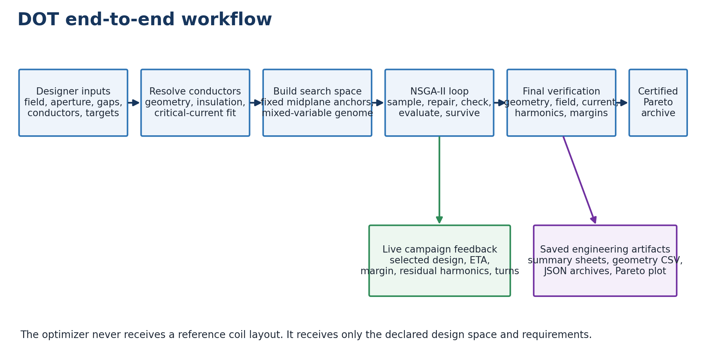
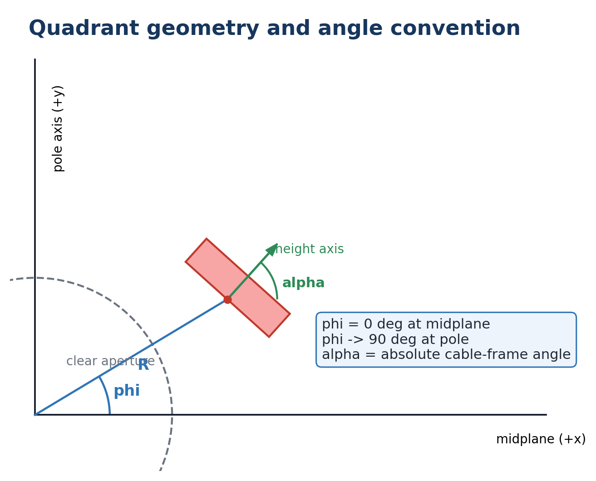
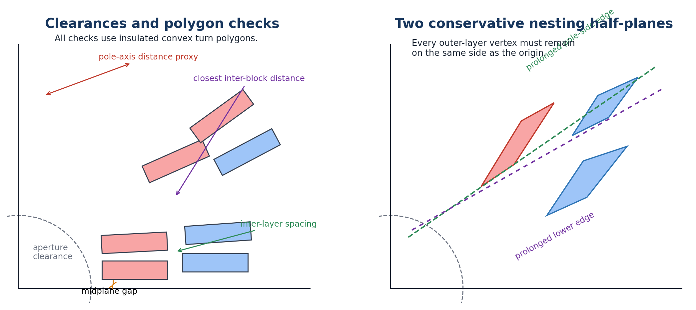
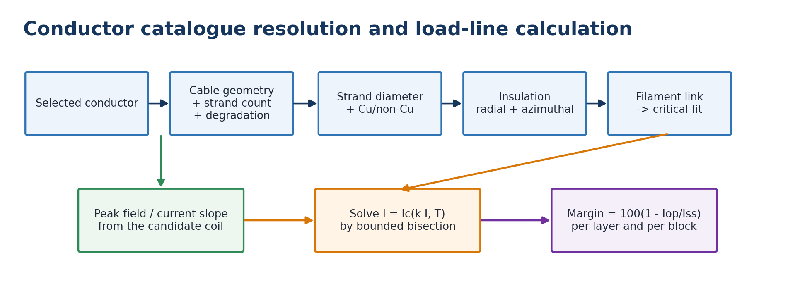
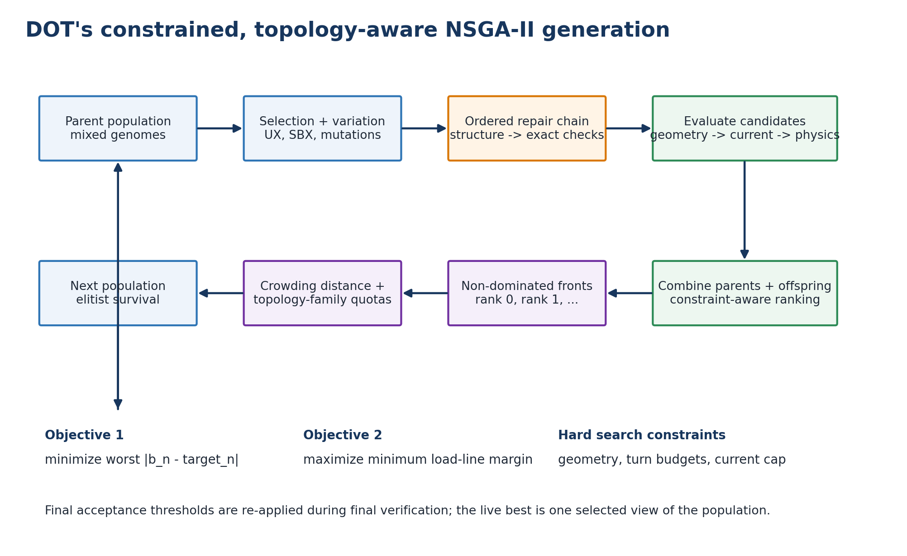
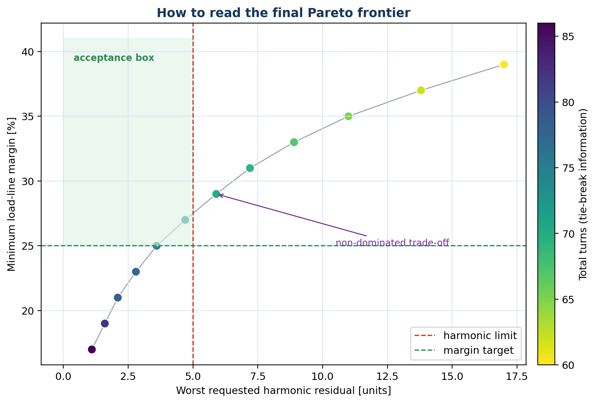
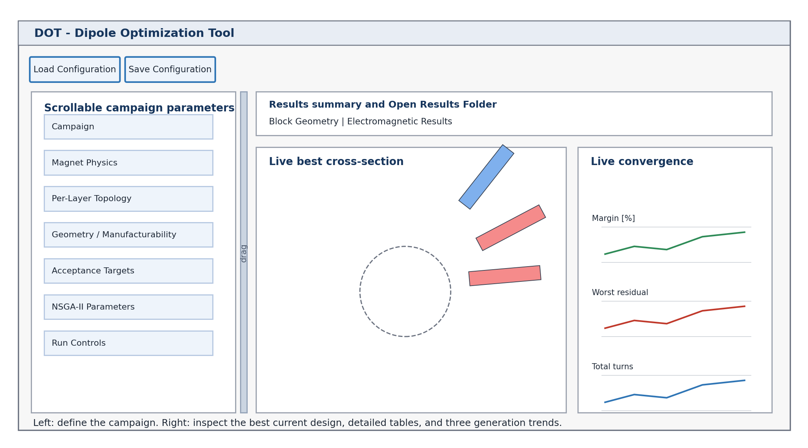

# DOT 1.0.0 - Dipole Optimization Tool

## Technical Reference and User Manual

Manual edition 1.1  
Software documented: DOT 1.0.0  
Date: 29 July 2026  
Author: Mattia Elisei, INFN Milan and University of Rome La Sapienza  
License: MIT

DOT autonomously synthesizes, evaluates, and certifies two-dimensional, coil-only superconducting dipole cross-sections. This manual describes the implementation that exists in the source code named above. It is both a technical disclosure of the calculation and a practical guide for running reproducible campaigns.

> Independent review status: the complete multi-agent audit of 29 July 2026 found no release
> blocker or physics defect. The audit record is `docs/ANTIGRAVITY_AUDIT_2026-07-29.md`.



## Document purpose and trust boundary

The purpose of this document is to make every important engineering decision made by DOT visible. A designer should be able to answer all of the following questions without reading the source code:

- What inputs are fixed by the user, and what does the optimizer decide?
- How is a block and a turn represented geometrically?
- Which geometric conditions are exact polygon checks, which are constructive rules, and which are conservative proxies?
- How are bore field, harmonics, peak field, critical current, and load-line margin calculated?
- How does NSGA-II preserve competing electromagnetic objectives and different topologies?
- What is shown live, what is saved, and what has passed final certification?
- What does a successful result establish, and what remains outside the model?

DOT is a pre-design and target-synthesis engine. It is not a construction drawing or a complete magnet sign-off. Version 1.0.0 models straight two-dimensional conductor blocks in an air-core, infinitely long magnet. It does not model iron, saturation, coil ends, persistent-current magnetization, mechanical stress, conductor motion, training, quench protection, field errors from manufacturing tolerances, or three-dimensional effects. A certified DOT design is certified only against the declared two-dimensional model and constraints.

The final engineering workflow must therefore include an independent field solution, tolerance analysis, mechanical and protection design, and a three-dimensional end design before a magnet can be considered buildable.

## 1. The design problem solved by DOT

The user specifies the magnet-level requirements and the permitted design space:

- target bore field;
- aperture and reference radii;
- number of radial coil layers;
- one conductor catalogue selection per layer;
- azimuthal gap at the midplane for every layer;
- radial gap between successive layers;
- minimum and maximum number of active blocks per layer;
- permitted turns per block and angular bounds;
- geometric and manufacturability constraints;
- requested normal harmonic orders and signed targets;
- minimum load-line margin and maximum operating current;
- search effort and random seed.

DOT then chooses a cross-section. The first, midplane block of each layer has its radius, azimuthal position, and cable orientation derived from the user gaps. DOT chooses the number of turns in that block. For every later optional block it chooses whether the block exists, its number of turns, its azimuthal position `phi`, and its cable-frame angle `alpha`. The user fixes the layer count, conductor assignment, and maximum topology size; the optimizer never changes the cable assigned to a layer.

The optimizer has no reference-magnet block locations or turn allocation. It searches the permitted space and attempts to find a family of non-dominated designs that trades field quality against load-line margin. Final acceptance is decided by a separate, fixed numerical verification.

### 1.1 What a campaign returns

A successful campaign returns a certified Pareto archive, not merely one scalar optimum. Every retained design satisfies all declared geometric constraints, turn budgets, operating-current bounds, harmonic residual limit, and minimum margin during final verification. The GUI selects one representative for immediate display, while the archive and final Pareto plot preserve the trade-off set.

If no design passes every acceptance target, DOT says so explicitly. It saves the final search front and the closest candidates with named normalized violations. These are diagnostic designs, not certified designs.

## 2. End-to-end workflow

DOT uses the following sequence.

1. Validate campaign inputs and resolve every conductor through its catalogue links.
2. Convert the selected cable and insulation records into layer-specific turn geometry.
3. Derive the fixed first-block anchors from aperture, azimuthal gaps, radial gaps, and cable dimensions.
4. Build a mixed-variable genome with continuous angles, integer turns, and binary block-existence variables.
5. Construct and repair an initial population.
6. For every candidate, decode a unit-current coil and run the ground-truth geometry checks.
7. For a geometrically valid candidate, either solve the operating current exactly from the requested bore field or apply the exact fixed current and evaluate its field residual.
8. Evaluate harmonic residuals and load-line margins with the search calculation.
9. Apply constrained, topology-aware NSGA-II survival and create the next generation.
10. Report one selected live candidate, elapsed time, ETA, and convergence signals after each generation.
11. At the end, reconsider the complete final population rather than trusting a cached optimizer return value.
12. Independently recalculate every hard-feasible search candidate with fixed final settings.
13. Reject every design that fails any final acceptance condition.
14. Deduplicate, recompute non-dominance, apply only numerical-equivalence complexity tie-breaks, and export the certified archive.

The search and final verification stages deliberately use different numerical settings. Search
harmonics use a low-order Gauss-Legendre rule rather than a coarse equal-current midpoint grid;
this retains the speed of nine sources per turn while tracking the dense certification vector.
Peak-field search remains a lower-resolution midpoint calculation. Final certification is still
an independent, immutable dense calculation, so no search value establishes acceptance.

## 3. Coordinate system and geometric representation



### 3.1 Symmetry and quadrant

DOT constructs the coil in the first quadrant. The positive x-axis is the horizontal midplane and the positive y-axis points toward the pole. The complete dipole is generated electromagnetically by mirror symmetry; the user works only with the compact first-quadrant geometry.

The native angle convention is:

- `phi = 0 deg` at the midplane;
- `phi` increases counter-clockwise toward the pole;
- `phi = 90 deg` at the pole axis;
- `alpha` is the absolute angle of the cable height axis measured counter-clockwise from +x.

No angle conversion is required when reproducing the reported geometric parameters in another two-dimensional layout tool that uses the same convention.

### 3.2 Cable geometry

The selected catalogue records provide the bare cable height, inner width, outer width, and turn insulation. DOT defines:

`insulated inner width = bare inner width + 2 * azimuthal insulation`

`insulated outer width = bare outer width + 2 * azimuthal insulation`

`insulated height = bare height + 2 * radial insulation`

Geometry constraints use the insulated turn polygon. Peak-field evaluation uses the corresponding bare-conductor polygon, because the critical-current limit belongs to the conductor rather than its insulation.

### 3.3 Turn polygon and cable frame

Each turn is a convex quadrilateral. Let the cable height direction be

`e_h = (cos(alpha), sin(alpha))`

and the cable-width direction be

`e_w = (-sin(alpha), cos(alpha))`.

For a rectangular cable, the anchor is the midpoint of the inner face. For a keystoned cable, the anchor is the midplane-side corner of the inner face. The four polygon corners are then constructed from the anchor, the height direction, the width direction, and the inner and outer cable widths.

Turns within a block are arc-stacked on a circle at the block inner radius. Their anchors advance toward larger `phi`, that is, from the midplane toward the pole. A keystoned cable also changes the local orientation of successive turns by the cable keystone angle

`theta_key = atan2(width_outer - width_inner, height)`.

The exact per-turn orientation is retained and reused when the bare conductor polygon is reconstructed for peak-field evaluation.

### 3.4 Block and layer

A block contains one or more turns with a common first-turn `phi`, first-turn `alpha`, cable, inner radius, and series current. A layer contains an ordered tuple of blocks at one inner radius. The decoded block order is always midplane to pole.

Every active block carries the same series current. DOT rejects a design with inconsistent block currents when solving its operating point.

## 4. From user gaps to fixed midplane anchors

The current GUI asks for physical gaps rather than raw first-block coordinates.

### 4.1 Layer 1

The first layer has no radial-gap input. Its inner radius is exactly the aperture radius:

`R_1 = aperture radius`.

For a requested one-sided azimuthal gap `g_a,1`, the first-block azimuth is

`phi_1 = atan2(g_a,1, R_1)`.

The first-block cable angle is fixed:

`alpha_1 = 0 deg`.

DOT still optimizes the number of turns in this block.

### 4.2 Later layers

For layer `k > 1`, DOT first constructs the preceding layer's first insulated turn. It finds the maximum x-coordinate of that polygon and adds the requested radial interface gap:

`R_k = max_x(first insulated turn in layer k-1) + radial gap_k`.

The new layer's first-block angle is then

`phi_k = atan2(azimuthal gap_k, R_k)`

and `alpha_k = 0 deg`.

This definition makes the radial gap a physical distance from the preceding layer's actual first insulated turn, including cable thickness and insulation. With `N` layers, the GUI therefore requires `N` azimuthal gaps and `N-1` radial gaps.

### 4.3 Fixed and optimized quantities

| Quantity | Midplane block | Later block slots |
|---|---|---|
| Layer inner radius `R` | Derived and fixed for the layer | Same fixed layer radius |
| Existence | Always active | Binary optimizer decision |
| Turns | Integer optimizer decision | Integer optimizer decision when active |
| `phi` | Derived and fixed | Continuous optimizer decision |
| `alpha` | Fixed at 0 deg | Continuous optimizer decision |

Optional blocks are represented as a contiguous active prefix. For example, a four-slot layer may decode as one, two, three, or four active blocks, but it cannot contain active blocks 1 and 3 with block 2 absent.

## 5. Geometric feasibility and manufacturability constraints



DOT separates three mechanisms that are sometimes confused:

- **Constructive geometry** fixes anchors and builds ordered turn polygons.
- **Repair operators** project many invalid genomes toward valid geometry before expensive physics evaluation.
- **Ground-truth feasibility checks** decide whether the actual insulated polygons are admissible.

Repair never replaces certification. A candidate that remains invalid after repair receives a geometry constraint violation and is not evaluated as an acceptable design. Final certification runs the complete feasibility suite again.

### 5.1 Numerical tolerance

The default geometry tolerance is 0.005 mm. It is used only to classify contact and small round-off differences. It is not an engineering clearance. A designer who needs 0.5 mm of physical space must request 0.5 mm; increasing the numerical tolerance does not reserve that space.

Violations are reported with native geometric severity, generally in millimetres. The optimizer normalizes different violation types before constrained selection. It uses the maximum normalized geometry violation, not a sum over all offending turn pairs, so a candidate is not punished merely because one collision is reported many times.

### 5.2 Aperture clearance

For every insulated turn polygon, DOT computes the exact minimum distance from the origin to the polygon. The clearance is

`clearance = distance(origin, polygon) - aperture radius`.

A turn is invalid if this clearance is below minus the numerical tolerance. This catches tilted inner corners that can intrude into the circular aperture even when the nominal layer radius equals the aperture radius.

### 5.3 Midplane clearance

For every insulated turn polygon, DOT finds its minimum y-coordinate. A violation occurs when

`min_y < requested midplane clearance - tolerance`.

In the current GUI, the physical azimuthal gap is already used constructively to derive the first-block anchor, so the separate feasibility value passed by the GUI is zero. The polygon check still prevents crossing the symmetry plane. Headless schema-v1 campaigns also provide `geometry.midplane_gap_mm`; that value is used both as a default anchor gap and as a feasibility requirement unless layer-specific gaps override the anchor.

### 5.4 Inter-layer spacing

For generated layer geometry, DOT uses the conventional radial-build definition

`outer layer inner radius - inner layer inner radius - insulated radial height of inner cable`.

This is a layer-mandrel spacer, not the global shortest Euclidean distance between arbitrary corners of tilted blocks. Treating it as the latter would incorrectly reject published accelerator layouts whose azimuthally separated blocks have closer diagonal corners while remaining mechanically separated. DOT independently rejects all positive-area polygon overlap between layers.

The GUI embeds each requested radial gap constructively in the fixed first-block anchor. Headless campaigns can additionally impose the scalar `geometry.inter_layer_gap_mm` radial-build threshold.

### 5.5 Turn non-intersection

DOT checks every pair of insulated turn polygons. Positive convex-polygon overlap depth greater than the numerical tolerance is rejected. The check covers turns within a block, between blocks of one layer, and between layers.

This is the collision ground truth. A separate inter-block gap check does not double-count overlap; overlap is handled here, while inter-block clearance handles positive separation that is too small.

### 5.6 Minimum inter-block closest-point distance

For every pair of active blocks in the same layer, DOT calculates the exact shortest Euclidean distance between all their insulated turn polygons. The minimum may be declared independently for each layer. The condition is

`closest block distance >= requested layer clearance - tolerance`.

This is the GUI's **Min block clearance [mm]** control. It reserves physical room for wedges, extra insulation, or winding clearance and is not an angular approximation.

The code also contains fixed 0.10 mm electrical-gap and 1.0 mm wedge-gap convenience checks for direct API use. The GUI campaign path does not automatically add both fixed checks; it uses the user-declared per-layer closest-point clearance.

### 5.7 Conventional pole-side nesting

For each adjacent layer pair, DOT identifies the pole-most block and pole-most turn of the inner layer. It prolongs that turn's pole-side long edge as an infinite line. Every vertex of every turn in the outer layer must remain on the same side of this line as the origin.

This defines a half-plane winding envelope. It prevents an outer layer from entering the pole-side continuation of the inner layer's winding surface.

### 5.8 Extended lower-edge nesting

DOT also prolongs the lower, midplane-side long edge of the same inner-layer pole turn. Again, every outer-layer vertex must remain on the origin side of the infinite line.

The second half-plane is deliberately conservative. It screens out layouts that fit as isolated polygons but would enter the continuation of the lower cable surface and be unfavorable to layer nesting and winding.

Both nesting checks are active only when **Enforce layer nesting** is selected. The current GUI enables the checks by default. In a headless campaign, `max_nesting_repair_deg` can additionally permit an outer-layer repair shift of up to the stated angle. The GUI does not set that repair cap; it relies on constructive ordering, the exact checks, and the ground-truth shrink/angle repairs. Whether repaired or not, the same two half-plane checks decide feasibility and certification.

### 5.9 First-layer pole-turn distance proxy

The GUI asks for **Layer 1 min pole-turn radius [mm]**. DOT calculates the closest distance from any point of any first-layer insulated turn polygon to the pole symmetry axis. A polygon crossing that axis has distance zero.

The condition is

`closest first-layer cable point to pole axis >= requested proxy - tolerance`.

This is not a literal cable-centerline curvature radius. Straight two-dimensional polygons do not contain the end-turn or curved winding path needed to calculate curvature. The quantity is a conservative clearance proxy intended to discourage pole turns with insufficient space for a windable bend and to reduce strand pop-out risk. The designer must perform a real end-turn and bending-strain analysis later.

### 5.10 Optional legacy checks

The geometry API retains an optional pole-axis clearance and a legacy pole-angle limit for old configurations and direct tests. New GUI campaigns do not expose a maximum pole angle and do not use it. They use the first-layer pole-turn distance proxy instead.

### 5.11 Topology and turn-budget constraints

The following are structural or hard constraints even though they are not polygon-distance checks:

- the first block of every layer is active;
- active optional blocks form a contiguous prefix;
- every layer satisfies its minimum active-block count;
- every active block obeys its integer turn bounds;
- optional total-turn and turns-per-layer limits are enforced when present in a headless campaign;
- every block has a valid cable assignment and common series current.

## 6. Geometry repair before evaluation

Variation operators can create crossed blocks, excessive turns, or collisions. DOT applies a deterministic repair chain to both the initial population and offspring:

1. **Contiguous-active-block repair** converts each layer to an active prefix.
2. **Minimum-active-block repair** reactivates blocks as needed to meet the per-layer floor.
3. **Radial compaction** moves each layer radius to the tightest permitted value based on the preceding layer and configured radial bounds. In the GUI, gap-derived radii are fixed, so this preserves the fixed anchor.
4. **Turn-budget repair** greedily reduces the largest reducible turn counts until optional total and per-layer budgets are met.
5. **Phi-ordering repair** pins the first block to its midplane-clearance position and makes each later `phi` at least the preceding block's `phi` plus a turn-footprint-aware angular separation.
6. **Layer-nesting repair**, when a positive repair cap is configured, shifts all non-midplane blocks of an offending outer layer toward the midplane by the smallest bisection-solved amount that clears both nesting half-planes. If angular room is the limiting factor, it may reduce the outer layer's midplane-block turns one at a time, never below its bound.
7. **Ground-truth repair** runs the real polygon feasibility suite. It first moves a pole-boundary offender toward the midplane, then tests small `alpha` changes for aperture intrusions, and finally reduces or deactivates offending non-midplane blocks before touching the midplane block.

The nesting and ground-truth steps are alternated three times because shrinking an inner pole block can change the nesting lines and create a new coupled violation.

Ground-truth repair is bounded to 40 attempts. It is a safety net, not a promise that every random genome becomes valid. Residual infeasibility remains visible to constrained selection. DOT intentionally does not clamp `alpha` to a simple `phi`-alignment law; valid magnet blocks can require a wider independent angle range.

The phi-ordering separation is a constructive approximation for efficient search. The exact closest-point, collision, aperture, and nesting checks remain decisive.

## 7. Electromagnetic model

### 7.1 Model assumptions

The electromagnetic kernel assumes:

- infinitely long currents parallel to the z-axis;
- two-dimensional magnetostatics;
- no iron or magnetic material;
- one quadrant of a normal dipole with exact mirror symmetry;
- linear superposition and field-current proportionality;
- uniform series current through all turns.

These assumptions are why operating current can be eliminated from the genome and either solved exactly or imposed as a fixed value after geometry is chosen.

### 7.2 Filament discretization

DOT supports two current quadratures on the same bilinear turn coordinates. The midpoint rule
uses an `n1 x n2` grid of equal-current line filaments at cell centers. Each midpoint filament
carries

`I_filament = I_turn / (n1 * n2)`.

The search harmonic calculation instead uses a tensor-product 3 x 3 Gauss-Legendre rule. Its
filaments carry the corresponding quadrature weights, whose sum is exactly the turn current.
This is much more accurate for smooth bore multipoles at the same nine-source cost. Certification
uses the traditional 12 x 12 midpoint rule. For near-field peak evaluation, where convergence
near conductor boundaries is different, search uses an 8 x 8 midpoint grid and certification
uses 80 x 80.

The setting names, grid sizes, and bore quadrature are recorded in headless result documents.
A campaign may explicitly override them in its JSON definition.

### 7.3 Normal-dipole mirror orbit

A compact first-quadrant source `(x, y, I)` is expanded internally into

`( x,  y,  I)`

`(-x,  y, -I)`

`(-x, -y, -I)`

`( x, -y,  I)`.

This produces the fourfold current pattern of a normal dipole. In exact symmetry, all even multipoles and all skew multipoles cancel analytically.

### 7.4 Biot-Savart field

For an infinite line current at source position `(x_s, y_s)`, a probe at `(x, y)` receives

`B_x = -(mu0 / 2 pi) * I * (y - y_s) / rho^2`

`B_y =  (mu0 / 2 pi) * I * (x - x_s) / rho^2`

with `rho^2 = (x-x_s)^2 + (y-y_s)^2` in square metres. Geometry enters the public API in millimetres and is converted internally. A probe coincident with a filament is rejected as a singularity.

Vectorized field evaluation uses chunking to limit dense intermediate memory. When Numba is available and not disabled, the same calculation uses compiled kernels; the mathematical result does not change.

### 7.5 Operating-current modes

Candidates are decoded at a common reference current. With different minimum and maximum current bounds, or with only one bound present, DOT computes the center `B_y` and scales every block current by

`scale = target bore field / decoded center B_y`.

Therefore

`I_operating = I_reference * scale`.

With no iron, this is the exact target-field solution, not an iterative approximation. The solved current magnitude is checked against both optional hard bounds. Current is not a gene and cannot drift outside the range unnoticed.

When `min_current_a` equals `max_current_a`, DOT switches to fixed-current mode. It applies that current magnitude exactly to every series block and automatically chooses the polarity that produces the requested dipole-field direction. Because current can no longer be scaled to force the field, the actual center field becomes a graded equality constraint. DOT accepts

`|B_actual - B_target| <= max(10^-7 T, 10^-4 |B_target|)`.

Thus “fixed current” means exact current magnitude with a 0.01% relative target-field matching tolerance, not a rounded current window. The fixed-current field condition and ordinary current bounds are rechecked during final verification.

### 7.6 Multipole convention

DOT uses the complex expansion

`B_y + i B_x = sum from n=1 of C_n * (z / R_ref)^(n-1)`.

Relative normal and skew coefficients are

`b_n = 10^4 * Re(C_n) / Re(C_1)`

`a_n = 10^4 * Im(C_n) / Re(C_1)`.

Thus `b_1 = 10000` for a normal dipole, and one unit is `10^-4` of the main normal dipole field at the declared reference radius. The reference radius must be smaller than the radius of every source.

For the exact quadrant symmetry, DOT calculates odd normal multipoles and sets even and skew coefficients to zero analytically. The GUI reports requested odd terms `b3, b5, ...` through the chosen maximum order.

### 7.7 Harmonic targets and objective

Each requested normal harmonic may have a signed target. DOT calculates the residual

`r_n = b_n - target_n`

and the field-quality objective

`f_h = max over requested n of |r_n|`.

For an ordinary air-core target, every `target_n` is zero. A nonzero target is useful for deliberate pre-compensation. If a later yoke model is expected to add +3 units to `b3`, the designer may request `b3 = -3` from the coil-only layout. The final acceptance limit applies to the residual, not to `|b_n|` alone.

## 8. Conductor data and load-line margin



### 8.1 Linked catalogue resolution

The user supplies one `.cadata` file for every layer and selects the exact, case-sensitive `CONDUCTOR` name from that file. The GUI filters the selected catalogue and populates the drop-down only with conductors whose linked cable, strand, insulation, filament, and critical-current records are complete and whose fit DOT supports. Unsupported conductors are not offered, and an obsolete imported configuration that names one is rejected before a campaign starts.

`CONDUCTOR -> CABLE, STRAND, INSUL, FILAMENT -> critical-current fit`.

This prevents geometry from one cable, copper ratio from another strand, and a fit from an unrelated conductor family from being combined accidentally.

The required cable data include strand count, cable degradation, cable dimensions, strand diameter, copper/non-copper area ratio, insulation, and a supported critical-current fit. Supported fit types in version 1.0.0 are REMFIT type 1 (Bottura Nb-Ti) and type 11 (CERN high-field Nb3Sn). The coefficient sets `FIT1`, `HFM1`, `MQXFS5`, and `PIT192` have been compared with executable reference calculations; names are catalogue identifiers, while support is determined by the REMFIT type and coefficients. Types 2-10 are preserved as typed unsupported catalogue results for diagnostics, but are excluded from the GUI selector and cannot launch a GUI campaign.

### 8.2 Non-copper area and cable critical current

The catalogue `Cu/non-Cu` value is interpreted as the engineering copper to non-copper area ratio. For strand diameter `d`,

`A_total = pi d^2 / 4`

`A_nonCu = A_total / (1 + Cu/non-Cu)`.

The critical-current density fit is interpreted as non-copper `Jc`. Strand and cable critical currents are

`Ic_strand = Jc * A_nonCu`

`Ic_cable = N_strands * Ic_strand * (1 - degradation_percent / 100)`.

This calculation uses SI units internally and returns amperes.

### 8.3 Supported critical surfaces

For a type-1 Nb-Ti fit with coefficients `C1 ... C7`, DOT implements

`Bc2(T) = C7 * [1 - (T/C2)^1.7]`

and

`Jc(B,T) = C1*C6*B^(C3-1) / Bc2(T)^C3 * [1-B/Bc2(T)]^C4 * [1-(T/C2)^1.7]^C5`.

For a type-11 Nb3Sn fit with parameters `C0, Bc20, Tc0, alpha, v, p, q`, DOT implements

`Bc2(T) = Bc20 * [1 - (T/Tc0)^v]`

`C(T) = C0 * [1-(T/Tc0)^v]^alpha * [1-(T/Tc0)^2]^alpha`

`Jc(B,T) = C(T)/B * [B/Bc2(T)]^p * [1-B/Bc2(T)]^q`.

The code checks the temperature and field domains and refuses evaluations at or above `Bc2(T)`.

### 8.4 Peak field on the conductor

DOT reconstructs every bare turn polygon and samples 16 points around its boundary: each edge start plus its quarter, half, and three-quarter positions. It evaluates the field magnitude at all sample points using the full mirrored coil and finds a peak independently for every evaluated layer and active block.

The boundary samples, rather than only corners and midpoints, are important for keystoned multi-turn blocks because a near-field maximum can lie between adjacent turns.

The computed peak is a discretized two-dimensional proxy. It converges with the filament grid and boundary sampling but is not a continuous finite-element maximum or a three-dimensional end-field maximum.

### 8.5 Short-sample current

Because the air-core field is linear in current, the load-line slope for a layer or block is

`k = B_peak / I_operating`.

DOT solves the intersection

`I = Ic_cable(k I, T)`

by bisection. The upper bracket is kept slightly below `Bc2(T)/k`, so every critical-surface call stays inside its valid domain. The default current-space tolerance is `10^-6 A`, with at most 200 iterations.

### 8.6 Margin definition

For operating current `Iop` and short-sample current `Iss`,

`margin [%] = 100 * (1 - Iop / Iss)`.

DOT reports the peak field, `Iop`, `Iss`, and margin for every active block and every conductor layer. The optimization objective uses the minimum layer margin. Continuous block numbering starts at the midplane block of layer 1 and proceeds poleward, then continues at the midplane block of layer 2, and so on.

### 8.7 Non-binding current advice

The GUI can estimate a current ceiling before a campaign. Let the desired margin fraction be `m/100` and `f = 1 - m/100`. It assumes optimistically that the operating peak field equals the requested bore field:

`Bop_assumed = Bbore`

`Bss_assumed = Bbore / f`.

It evaluates the layer-1 conductor at `Bss_assumed`, obtains `Ic_cable`, and reports

`I_advice = f * Ic_cable(Bss_assumed, T)`.

In a real coil, `Bpeak > Bbore`, so the usable current for the requested margin will normally be lower. The advice is an upper-bound estimate and never overwrites either editable current field. The actual range or fixed-current choice remains entirely under user control.

## 9. Optimization variables and search space

For each layer, the mixed genome contains:

- one real inner-radius variable, fixed when lower and upper bounds are equal;
- the first-block real `phi` and integer turns;
- for every later block slot: real `phi`, integer turns, binary active state, and real `alpha`.

The first-block `alpha` is a fixed topology value rather than a gene. For a layer with `B` maximum block slots, the raw mixed genome contributes `1 + 2 + 4(B-1)` variables. The total genome is the sum over layers.

Integer turns are rounded and clipped to their declared bounds. Binary variables decide optional block existence. Decoding skips inactive block slots and renumbers active blocks consecutively for the engineering output.

The layer count, cable assignment, aperture radius, maximum block slots, and variable bounds do not evolve. They define the campaign's hypothesis space and strongly affect whether the desired design is reachable.

## 10. NSGA-II in DOT



### 10.1 Why a multi-objective algorithm is required

Field quality and load-line margin compete. Removing or moving conductor can improve a harmonic while reducing transfer function or margin; adding conductor can reduce required current but disturb the multipoles. A single weighted sum hides this trade-off and requires arbitrary weights before the designer has seen the frontier.

DOT therefore uses NSGA-II, the elitist non-dominated sorting genetic algorithm described by Deb, Pratap, Agarwal, and Meyarivan. It minimizes two objectives simultaneously:

`F1 = worst requested harmonic residual in units`

`F2 = - minimum layer load-line margin in percent`.

Minimizing `F2` maximizes the physical margin.

### 10.2 Dominance

For two feasible objective vectors `A` and `B`, `A` dominates `B` if `A` is no worse in both objectives and strictly better in at least one. The non-dominated set is rank 0. Removing it and repeating gives rank 1, rank 2, and so on.

Points on rank 0 express different valid compromises. A very pure field with lower margin and a higher-margin design with a larger harmonic residual can both belong to the final frontier.

### 10.3 Constraint handling

NSGA-II first distinguishes constraint feasibility. Geometry, current bounds or the fixed-current field condition, and optional turn budgets are hard search constraints. Harmonic residual and negative margin remain the two objectives throughout evolution; the requested harmonic and margin limits are applied during final verification.

This single policy preserves both sides of the trade-off. A promising high-margin design is not eliminated merely because its harmonics have not yet reached the final limit, and vice versa. The current lower and upper bounds and the fixed-current field condition are always hard.

### 10.4 Constructive initial population

Initial samples are not pure independent random numbers. Every layer receives a random active-block count between its minimum and maximum, represented as a contiguous prefix. Sixty percent of the initial population receives generic sector-coil physics seeding:

- a sector span is sampled between 48 and 62 degrees;
- a turn target is estimated from cable width and layer radius;
- turns are distributed among the active blocks;
- ordered block positions are generated with turn-footprint and gap awareness;
- non-midplane `alpha` values are sampled near local radial alignment with a 5-degree normal spread.

The remaining forty percent is kept broadly random, then ordered and repaired. No reference-magnet block coordinates or turn allocations enter the sampler.

### 10.5 Parent selection and variation

DOT uses pymoo's NSGA-II framework with mixed-variable operators:

| Variable type | Crossover | Mutation |
|---|---|---|
| Optional block active state | Uniform exchange | Bit flip |
| Real `phi`, `alpha`, and free radius | Simulated binary crossover | Polynomial mutation |
| Integer turns | Uniform exact exchange | Polynomial mutation, rounded, per-variable probability 0.20 |

Uniform exchange for integer turns avoids blending two discrete counts into an artificial midpoint before rounding. The explicit 0.20 turn-mutation probability remains a strong source of new turn allocations even for long genomes.

Mixed-genome duplicate elimination is disabled because the standard array conversion is incompatible with dictionary-valued mixed individuals. Final archives are explicitly deduplicated by decoded geometry.

### 10.6 Elitist survival and crowding distance

Parents and offspring are combined. Candidates are sorted into non-dominated fronts. Complete better-ranked fronts are retained first. When the next front does not fit entirely, NSGA-II uses crowding distance: points in sparsely populated objective-space regions receive preference, preserving a spread along the trade-off frontier.

### 10.7 Topology-family preservation

Ordinary rank and crowding can allow one active-block pattern to occupy the population too early. The GUI therefore defines a topology family only by active block count per layer, such as `blocks:4,3,2,2`. Turn counts are deliberately excluded because they change continuously and would fragment the family definition.

For a GUI campaign, the number of possible families is the product of `(max blocks - min blocks + 1)` over layers. DOT selects a population-scaled family floor, limited by the possible families, population size, and a range from 4 to 32. Survival then proceeds in three passes:

1. retain one best-ranked representative from unseen families until the family floor is reached;
2. fill by rank and crowding while respecting a per-family cap;
3. if quotas leave empty slots, fill from the same rank/crowding order without quotas.

The fallback guarantees a complete population. Family preservation improves structural diversity but does not certify a family or make it electromagnetically good.

### 10.8 Feasibility-aware offspring regeneration

Feasibility-aware offspring regeneration is part of every campaign. After crossover, mutation, and the repair chain, DOT runs the exact geometry checks. An invalid child is redrawn from the same parent pool up to three times. If those attempts fail, the constructive sampler provides a fallback candidate, which is checked again.

This mechanism improves the fraction of usable offspring. It does not change mutation strength and does not bypass constraint evaluation.

### 10.9 One generation in operational order

The effective order is:

1. select parents from the current population;
2. apply mixed-variable crossover and mutation;
3. execute the full repair chain;
4. regenerate persistently invalid offspring when enabled;
5. decode each candidate at reference current;
6. run ground-truth geometry and turn-budget gates;
7. solve current for the target bore field;
8. evaluate harmonics and margins with the search calculation;
9. calculate hard-constraint violations and the two objectives;
10. combine parents and offspring;
11. perform constrained non-dominated sorting, crowding, and topology-aware survival;
12. select one live design using the search-population objectives;
13. recompute that selected design's harmonics and block margins with the final numerical settings;
14. update the GUI and generation archive with those recalculated values.

### 10.10 The live best is not the final optimum

Among hard-feasible individuals, DOT chooses the live display candidate by first minimizing total violation of the harmonic-margin target box and then a balanced score based on harmonic and margin target ratios. If no individual is hard-feasible, it displays the candidate with the smallest maximum constraint violation.

This rule gives the user a useful evolving representative. It is not an extra optimization objective and does not replace the Pareto archive. The population is not fully recalculated every generation: NSGA-II selects the representative using the search values, then DOT evaluates that one geometry with the same settings used during final verification. Consequently, the plotted margin, harmonic residual, or total turns can move in a direction that looks worse when the representative switches to a different trade-off branch.

### 10.11 Stop behavior and reproducibility

The Stop button is cooperative. DOT completes the active generation and then stops; it does not terminate a population evaluation halfway through.

A fixed seed, identical inputs, identical software environment, and the same parallel configuration are intended to reproduce the campaign. Multiple independent seeds can be merged in headless mode. The merged archive is re-certified and non-dominance is recomputed.

## 11. Final verification

The optimizer's cached final `X`, objectives, or constraints are not treated as engineering truth. DOT reads the whole final population and applies the following sequence to every hard-feasible search candidate:

1. Decode the geometry and either solve the target-field current or apply the exact fixed current again.
2. Re-run the complete geometric feasibility suite.
3. Re-check total and per-layer turn budgets.
4. Recompute harmonics with the fixed final settings.
5. Apply every requested signed harmonic residual and final residual limit.
6. Re-check both operating-current bounds, or the fixed-current target-field condition.
7. Recompute peak field, short-sample current, and margin for every linked layer with the fixed final settings.
8. Apply the minimum-margin target.
9. Compute and save per-block peak field, short-sample current, and margin.
10. Reject any candidate with an exception, invalid domain, or failed condition.

Certified survivors are deduplicated by layer radius and every block's `phi`, `alpha`, and turns, with coordinates rounded to eight decimal places for the key. DOT then recomputes rank-zero non-dominance from the certified objective pairs.

Fewer turns and fewer active blocks are not ordinary objectives. They are used only when two electromagnetic objective pairs are equal within numerical-noise tolerances (`rel_tol = 10^-12`, `abs_tol = 10^-9`). Among such equivalent designs, DOT prefers fewer total turns, then fewer active blocks. This prevents complexity preference from erasing a physically different harmonic-margin compromise.

There is no post-NSGA local refinement stage in version 1.0.0.

## 12. Understanding the Pareto frontier



The final plot uses:

- x-axis: worst requested harmonic residual;
- y-axis: minimum load-line margin;
- color: total number of turns;
- vertical line: harmonic residual limit;
- horizontal line: margin target.

Certified designs must lie to the left of the harmonic limit and above the margin target. A point farther left has better field quality. A point higher has more current margin. Neither direction alone defines a universally best design.

Choose a design by considering the next engineering steps. Useful questions include:

- How much field-quality reserve is needed for iron, persistent-current, and tolerance errors?
- How much margin reserve is needed for peak-field underestimation and three-dimensional effects?
- Does a slightly more complex topology buy a meaningful electromagnetic improvement?
- Is the total turn count compatible with current, inductance, joints, and protection strategy?
- Are the wedges and clearances manufacturable with the intended insulation system?

The color scale is decision support, not a third dominance objective. If two points are not electromagnetically equivalent, the lower-turn point is not automatically preferred by the optimizer.

## 13. Using the GUI



### 13.1 Launching DOT on Windows

From the repository folder, double-click `launch_dot_gui.cmd`. On first use, the launcher:

1. locates 64-bit Python 3.11, 3.12, or 3.13 and verifies that its standard Tkinter/Tcl-Tk component is present;
2. creates a private `.venv` environment;
3. displays every direct and transitive package name it may install;
4. waits for explicit Y/N approval and exits without installing the listed packages if approval is declined;
5. upgrades the installation tools and installs DOT and all required packages;
6. attempts to install optional Numba acceleration;
7. falls back to the portable kernels if Numba is unavailable;
8. opens the GUI.

Later launches reuse the environment. An internet connection is normally required only for the initial package installation or an update.

From an activated developer environment, the equivalent commands are `dot gui` or `dot-gui`.

### 13.2 Window layout

The **Load Configuration** and **Save Configuration** buttons are in the upper toolbar. DOT sizes the startup window from the detected display and chooses an initial splitter position that keeps the controls readable without hiding the live plots. Each layer's catalogue path expands or contracts while its **Browse** button keeps a fixed visible position. The left parameter panel has a vertical scrollbar. Drag the vertical sash between the parameter and result panels to make the left side wider or narrower.

The right side contains:

- final or live result summary;
- **Block Geometry** and **Electromagnetic Results** tables;
- the live mirrored cross-section;
- three aligned convergence plots for margin, worst harmonic residual, and total turns.

The cross-section and convergence columns use equal layout weight so both remain visible as the window or splitter is resized. On a small display, use the control-panel scrollbar rather than enlarging the left pane until the plots become too narrow.

### 13.3 Recommended input order

#### Step 1 - Campaign

Set a meaningful campaign name and choose an output directory. DOT creates a timestamped subfolder, so repeated runs do not overwrite each other.

#### Step 2 - Magnet Physics

Enter the target bore field, aperture radius, maximum harmonic order, number of layers, and operating temperature.

The GUI automatically sets the reference radius to two-thirds of the aperture radius, rounded to 0.001 mm. For example, an aperture radius of 25 mm gives 16.667 mm. The field remains editable: clear **2/3 aperture (auto)** to enter and retain a project-specific value. Re-enable the check box to recompute it from the current aperture.

#### Step 3 - Per-Layer Topology

For each layer:

1. browse to the conductor catalogue file;
2. enter the exact conductor name from that catalogue;
3. set **Min blocks** and **Max blocks**;
4. set **Min Turns** and **Max Turns** per block;
5. enter the azimuthal midplane gap;
6. for every layer after layer 1, enter the radial interface gap;
7. set the minimum physical inter-block clearance.

The GUI uses broad internal `phi` and `alpha` search bounds. It derives the first-block `R`, `phi`, and `alpha` and does not ask the user to type those values.

Use a minimum of two blocks when an independent wedge degree of freedom is expected to be necessary for harmonic cancellation. Too small a maximum block count can exclude the target layout; too large a count expands the mixed search space.

#### Step 4 - Geometry and manufacturability

Set the first-layer pole-turn distance proxy, numerical tolerance, and whether to enforce both layer-nesting conditions. Layer nesting is the conservative adjacent-layer rule described in Sections 5.7 and 5.8: both long edges of the inner layer's pole-most turn are prolonged into boundary lines, and all outer-layer cable vertices must stay on the aperture side of both. It is stronger than simple non-collision because it protects the continuation of the winding envelope.

Treat the pole-turn value as a conservative two-dimensional screening quantity. Do not interpret it as a calculated end-turn bend radius.

#### Step 5 - Acceptance Targets

In **General**, set:

- maximum harmonic residual in units;
- minimum load-line margin;
- optional minimum operating current;
- optional maximum operating current.

Press **Refresh current advice** after selecting the first-layer conductor and setting field, temperature, and margin. Review the advice but decide the bounds independently. Leave the minimum blank when no lower bound is required. Enter the same positive value in **Min current** and **Max current** to use fixed-current mode; DOT then applies that exact current and searches for the requested bore field within the 0.01% fixed-current field tolerance.

In **Advanced harmonics**, enter a signed target for each requested odd normal harmonic. Leave zero for a standard air-core target.

#### Step 6 - NSGA-II Parameters

Choose a preset:

| Preset | Population | Generations | Intended use |
|---|---:|---:|---|
| Quick exploration | 160 | 80 | Check reachability and campaign setup |
| Design search (recommended) | 480 | 200 | Normal design exploration |
| Intensive search | 1000 | 300 | Slow, broad final search for complex multilayer coils |
| Custom | User value | User value | Controlled studies and benchmarks |

Set a seed for reproducibility. DOT always uses its single Pareto-search policy.

**Parallel candidate evaluation** is off by default. When enabled, the GUI leaves one logical CPU free and uses at most four workers. It can accelerate large populations, but process startup, memory, and serialization overhead may outweigh the benefit for small campaigns or restricted hardware. If worker creation fails, retry with it off.

#### Step 7 - Run

Click **Start Campaign**. DOT validates the inputs before launching the background worker. At each click it captures a fresh campaign snapshot from every value currently visible in the form, clears the preceding cross-section and convergence histories, and redraws the horizontal margin and harmonic acceptance lines from that snapshot. A finished campaign can therefore be followed immediately by another one in the same GUI session without inheriting targets or graph data from the prior run. Correct any reported conductor, range, or geometry error rather than weakening a constraint blindly.

<!-- pagebreak -->

### 13.4 Monitoring progress

During a run, watch:

- generation number and progress bar;
- elapsed time and moving-window ETA;
- selected live cross-section;
- full block table with `R`, turns, `phi`, and `alpha`;
- every requested harmonic, target, and residual;
- every active block's peak field, short-sample current, and margin;
- minimum inter-block clearances and pole-turn distance;
- convergence of minimum margin, worst residual, and total turns.

The ETA is an estimate based on observed generation time and includes the live diagnostic calculations. A topology with more turns costs more to evaluate, so the ETA can move as the population changes.

The live design can change topology between generations. Its displayed harmonics, minimum margin, per-block load-line values, convergence curves, and generation JSON are recalculated before display. The live result is still an interim diagnostic, not a certification decision. Only the final certified table and files establish acceptance after DOT has rechecked the complete eligible final population.

### 13.5 After the run

If certified candidates exist, the result panel displays the representative's field, residual, margin, current, key clearances, and PASS status. Use **Open Results Folder** to inspect the complete archive and alternative topologies.

Finishing, stopping, or failing a campaign does not reset the campaign form. Every magnet, conductor, geometry, acceptance, and NSGA-II parameter remains at the value currently shown in the GUI, so the next campaign starts from the same user-defined setup unless the user edits it or loads another configuration.

If no certified candidate exists, DOT reports that outcome without promoting a near miss. Open the saved frontier and diagnostic archive. Determine whether the limiting issue is geometry, current, field quality, margin, or an insufficient design space before increasing search effort.

## 14. Saved results

Each GUI run creates

`<output>/<campaign>-YYYYMMDD-HHMMSS/`.

| Artifact | Meaning |
|---|---|
| `campaign.json` | Exact GUI state used to start the run |
| `generations/gen_NNNN.png` | Live representative cross-section at one generation |
| `generations/gen_NNNN.json` | Live metrics and block geometry at that generation |
| `best_candidate_cross_section.png` | Final representative geometry |
| `best_candidate_summary.png` | One printable sheet with cross-section, electromagnetic results, and geometry table |
| `best_candidate.json` | Machine-readable final harmonics, margins, current, field, and blocks |
| `best_candidate_geometry.csv` | Per-block `R`, turns, `phi`, and `alpha` |
| `pareto_candidates.json` | Certified archive, near-feasible diagnostics, and final search front |
| `final_pareto_frontier.png` | Residual versus margin, colored by total turns |
| `best_topology_designs/` | Up to ten best designs from distinct active-block-count families |
| `best_topology_designs/manifest.json` | Ranking, topology, metrics, certification state, and filenames |

The topology shortlist uses exactly one selected representative per active-block-count family. When no design certifies, the same folder is generated from the search front. The image title does not add an uncertified-search warning; the JSON document and shortlist manifest retain the explicit `certified: false` state and `uncertified_search_front` source for machine-readable provenance.

The geometry table uses continuous block numbering across layers. It is the most direct handoff for reconstructing the straight two-dimensional block layout.

## 15. Headless and command-line operation

### 15.1 Installation

For development or automation:

```powershell
python -m venv .venv
.venv\Scripts\Activate.ps1
python -m pip install -e ".[acceleration,dev]"
```

Portable installation without Numba is:

```powershell
python -m pip install -e .
```

### 15.2 Validate a campaign

```powershell
dot validate campaign/7T_NbTi_noiron_sample.json
```

Validation resolves the conductor files, checks the schema, builds the topology, and reports the layer count, requested harmonic orders, and seeds without running optimization.

### 15.3 Run a campaign

```powershell
dot optimize path/to/campaign.json --output results/my_campaign
```

Useful overrides are:

```powershell
dot optimize campaign.json --output results/run --population 240 --generations 180
dot optimize campaign.json --output results/run --seed 7 --seed 19 --seed 43
dot optimize campaign.json --output results/run --workers 4
```

`--quick` caps the population at 12, generations at 3, uses the first seed, and uses one worker. It is a pipeline smoke test only and says nothing about convergence.

The command prints one progress and ETA line per generation. For multiple seeds, DOT runs each campaign, re-certifies the union, and recomputes the non-dominated merged archive.

### 15.4 Minimal schema-v1 campaign pattern

```json
{
  "schema_version": 1,
  "geometry_angle_convention": "native-midplane-zero",
  "name": "example-dipole",
  "magnet": {
    "target_bore_field_t": 12.4,
    "aperture_radius_mm": 25.0,
    "reference_radius_mm": 16.667,
    "temperature_k": 1.9,
    "max_harmonic_order": 11
  },
  "acceptance": {
    "max_harmonic_units": 5.0,
    "min_margin_percent": 25.0,
    "min_current_a": 10000.0,
    "max_current_a": 13000.0,
    "harmonic_orders": [3, 5, 7, 9, 11],
    "harmonic_targets": {"b3": 0.0, "b5": 0.0}
  },
  "geometry": {
    "midplane_gap_mm": 0.15,
    "inter_layer_gap_mm": 0.5,
    "inter_block_gap_mm": [0.1, 0.1],
    "min_pole_turn_radius_mm": 10.0,
    "geometry_tolerance_mm": 0.005,
    "enforce_layer_nesting": true,
    "max_nesting_repair_deg": 15.0
  },
  "layers": [
    {
      "cadata": "conductors.cadata",
      "conductor": "INNER_CABLE",
      "max_blocks": 4,
      "min_blocks": 2,
      "turn_bounds": [1, 20],
      "azimuthal_gap_mm": 0.15,
      "phi_bounds_deg": [0.0, 86.0],
      "alpha_bounds_deg": [-15.0, 75.0]
    },
    {
      "cadata": "conductors.cadata",
      "conductor": "OUTER_CABLE",
      "max_blocks": 4,
      "min_blocks": 2,
      "turn_bounds": [1, 24],
      "radial_gap_mm": 0.5,
      "azimuthal_gap_mm": 0.15,
      "phi_bounds_deg": [0.0, 86.0],
      "alpha_bounds_deg": [-15.0, 75.0]
    }
  ],
  "optimization": {
    "population": 160,
    "generations": 100,
    "seeds": [7, 19],
    "workers": 1
  }
}
```

The conductor paths are resolved relative to the campaign file. Layer 1 must omit a nonzero radial gap. All layers must use either the gap-derived anchor mode or explicit radius bounds; do not mix the two modes.

**Mandatory for new headless campaigns:** always include

`"geometry_angle_convention": "native-midplane-zero"`.

For backward compatibility, the schema-v1 parser silently falls back to the legacy value `dot-pole-zero` when this key is omitted. Under that fallback, DOT transforms `phi_bounds_deg` as `(90 - phi_max, 90 - phi_min)`, negates and reverses `alpha_bounds_deg`, and converts any explicit first-block `phi` and `alpha`. Omitting the key can therefore reinterpret otherwise valid-looking angle bounds without an error. The legacy fallback exists only to load older files; it is not the recommended convention for a new campaign.

Headless campaigns use the same Pareto policy as the GUI. There is no search-mode or refinement switch.

## 16. Designing a reliable campaign

### 16.1 Establish a physically reachable search space

Search effort cannot recover a solution that the bounds exclude. Before a long campaign, check:

- the correct conductor and fit are assigned to every layer;
- the layer count and maximum blocks are sufficient for the expected harmonic control;
- minimum block counts do not force an unnecessarily complex or impossible topology;
- turn bounds allow enough conductor to meet current and margin requirements;
- `phi` and `alpha` bounds allow plausible pole blocks;
- the pole-turn proxy and nesting constraints are compatible with the aperture and cable dimensions;
- the requested current range, or fixed current, is physically consistent with the selected critical surface and available turn space.

Use the current advice as an upper-bound sanity check, not as proof of reachability.

### 16.2 Use progressive search effort

A practical sequence is:

1. run **Quick exploration** with a fixed seed to validate input and reveal gross infeasibility;
2. inspect near-feasible violations and topology diversity;
3. correct the design space or targets if physically justified;
4. run **Design search** with several seeds when using the CLI;
5. use **Intensive search** only after the campaign definition is stable;
6. compare fronts across seeds rather than trusting one scalar representative.

Increasing population improves simultaneous coverage of topologies and objective-space regions. Increasing generations gives existing lineages more opportunity to refine. For a mixed topology problem, population is often as important as generation count.

### 16.3 Interpret common failure modes

| Symptom | Likely causes | Action |
|---|---|---|
| No geometry-feasible candidates | Incompatible gaps, narrow angles, pole proxy, too many forced blocks | Inspect named geometry violations; widen only physically justified bounds |
| Current range violated | Transfer function needs too much or too little current | Adjust available turns/layers, conductor placement, or physically justified bounds |
| Fixed-current field mismatch | Geometry does not produce the target field at the exact requested current | Adjust turn space/topology or reconsider the fixed current |
| Margin too low | High peak field, unsuitable conductor grade, excessive current | Inspect per-block and per-layer margins; adjust conductor grading or topology |
| Harmonics plateau above target | Too few independent blocks, narrow `phi/alpha`, small population | Increase topology freedom or population before only adding generations |
| Search front exists but nothing certifies | Search values were slightly optimistic near a hard limit | Add engineering reserve and search for points comfortably inside the target box |
| Live plots move backward | Representative switched Pareto branch | Inspect the final frontier; do not treat each live curve as a monotonic scalar objective |
| Parallel run fails or slows down | Worker restrictions, memory, process overhead | Disable parallel evaluation and compare a short benchmark on the target hardware |

### 16.4 Keep engineering reserve

Do not target a point exactly on every boundary. The search and final calculations are not numerically identical; later iron, ends, mechanics, and tolerances add additional deviations. Prefer a robust region of the certified front with visible reserve in field quality, margin, current, and clearances.

## 17. Performance and acceleration

DOT uses two independent acceleration mechanisms.

### 17.1 JIT kernels

When Numba is installed, selected field and geometry kernels are compiled. The launcher attempts this installation automatically. Set `DOT_DISABLE_JIT=1` only for diagnosis or platform compatibility. JIT kernels are serial and do not create a nested thread pool.

The first compiled call can include warm-up cost. Benchmark complete campaigns after warm-up rather than only the first evaluation.

### 17.2 Process parallelism

Candidate evaluations are independent, so DOT can distribute them across a persistent process pool. Static topology and conductor data are initialized once per worker. Windows uses the spawn process model, and the worker count is bounded for platform safety.

Parallelism changes scheduling, not the equations. It consumes additional memory and has startup and serialization cost. Measure it on the hardware that will run production campaigns.

## 18. Verification, validation, and resilience

DOT's trust model is layered:

- unit tests cover conductor parsing, critical surfaces, geometry primitives, every feasibility check, repair operators, target-field current scaling, fixed-current polarity/field matching, multipoles, load-line details, campaign schemas, outputs, and GUI helpers;
- search and final numerical settings are versioned and stored;
- final candidates are re-evaluated independently of cached optimizer state;
- machine-readable inputs and results carry exact values rather than plot-only evidence;
- headless result manifests include SHA-256 hashes of the campaign and conductor files;
- GUI run folders include a runtime manifest plus immutable per-layer conductor-file snapshots;
- blind benchmark configurations contain requirements and conductor data but no reference block coordinates or turn allocation;
- unsupported fit types and missing catalogue links fail explicitly;
- worker-pool errors are returned to the GUI with a portable-mode recovery path.

At the software build documented here, the local regression suite contains 291 passing tests and 15 intentionally skipped tests that depend on unavailable external licensed software or data. A separate licensed reference-parity run contains 13 passing tests. These counts should be updated when the code or test suite changes.

### 18.1 Independent audit

The 29 July 2026 full-repository review checked source code, physics, tests, documentation,
packaging, launcher, CI, and validation evidence. It found no physics error and one release
blocker: CI still referenced three deleted benchmark configurations. The workflow now validates
the included sample campaign instead. The audit and closure record is
`docs/ANTIGRAVITY_AUDIT_2026-07-29.md`.

### 18.2 What certification does not prove

Certification does not prove:

- mechanical support or acceptable stress/strain;
- quench safety, voltage, hot-spot temperature, or protection feasibility;
- end-turn windability or three-dimensional bend radius;
- conductor degradation under cabling, reaction, handling, or loading beyond the catalogue factor;
- tolerance robustness or field-error reproducibility;
- iron-yoke performance, saturation, or fringe field;
- dynamic effects, persistent currents, coupling currents, or ramp-rate behavior;
- cryogenic, electrical, structural, or integration feasibility.

The correct interpretation is: *this decoded straight-block air-core cross-section satisfies the declared DOT equations and constraints during final verification*.

## 19. Parameter reference

| GUI parameter | Units | Role |
|---|---:|---|
| Campaign name | - | Output label only |
| Output directory | path | Parent of timestamped campaign folder |
| Target bore field | T | Exact scaling target in range mode; equality target in fixed-current mode |
| Aperture radius | mm | Clear bore radius and layer-1 radius |
| Reference radius | mm | Radius for normalized multipoles; auto `round(2/3 aperture, 3)` unless unlocked |
| Max harmonic order | integer | Highest requested odd normal term |
| Layers | 1-4 | Number of radial coil shells in GUI |
| Temperature | K | Critical-surface evaluation temperature |
| Conductor catalogue | path | Geometry and critical-current data source |
| Conductor name | text | Exact linked conductor selection |
| Min blocks | integer | Active-block floor preserved every generation |
| Max blocks | integer | Optional block slots available to search |
| Min Turns / Max Turns | integer | Per-active-block turn bounds |
| Azimuthal gap | mm | Derives first-block `phi` in each layer |
| Radial gap | mm | Derives layer radius after layer 1 |
| Min block clearance | mm | Exact closest polygon distance per layer |
| Layer-1 pole-turn radius | mm | Pole-axis distance proxy |
| Numerical tolerance | mm | Contact classifier only |
| Enforce layer nesting | boolean | Enables both prolonged-edge half-plane checks |
| Max harmonic residual | units | Final maximum absolute harmonic residual |
| Min load-line margin | % | Final minimum layer margin |
| Min current | A | Optional hard lower bound; equal to Max selects fixed-current mode |
| Max current | A | Optional hard upper bound; equal to Min selects fixed-current mode |
| Signed harmonic targets | units | Requested air-core `b_n` values |
| Search effort | preset | Population and generations |
| Seed | integer | Reproducibility control |
| Parallel evaluation | boolean | Optional process-level candidate evaluation |
| Geometry angle convention (headless) | text | Must be declared `native-midplane-zero` for new files; omission invokes legacy conversion |

## 20. Glossary

**Active block** - A decoded block slot that contains turns and participates in geometry and physics.

**Air-core** - A calculation with no magnetic material; field is exactly linear in current.

**Anchor** - Reference point used to construct a turn polygon.

**Block family** - The vector of active block counts per layer, used for population diversity.

**Crowding distance** - NSGA-II diversity measure in objective space.

**Dominance** - Relation in which one feasible point is no worse in every objective and better in at least one.

**Genome** - Mixed numerical representation evolved by the genetic algorithm.

**Harmonic residual** - Physical normal harmonic minus its signed target.

**Load line** - Linear relation between coil peak field and current for a fixed air-core geometry.

**Margin** - `100(1-Iop/Iss)` at the load-line critical-current intersection.

**Midplane block** - First and always-active block in a layer, fixed in `R`, `phi`, and `alpha` but variable in turns.

**Non-dominated front** - Set of trade-off points not dominated by another point.

**Numerical tolerance** - Small classifier allowance for near-contact, not a physical gap.

**Pareto archive** - Certified set of non-dominated designs.

**Pole-turn proxy** - Minimum first-layer insulated polygon distance to the pole axis; not literal curvature.

**Short-sample current** - Intersection of the cable critical-current surface with the geometry's load line.

**Topology** - In campaign inputs, the layer/cable/block-slot structure; in shortlist grouping, active block counts per layer.

## References

1. K. Deb, A. Pratap, S. Agarwal, and T. Meyarivan, "A fast and elitist multiobjective genetic algorithm: NSGA-II," *IEEE Transactions on Evolutionary Computation*, 6(2), 182-197, 2002. DOI: 10.1109/4235.996017.
2. L. Bottura, "A practical fit for the critical surface of NbTi," *IEEE Transactions on Applied Superconductivity*, 10(1), 1054-1057, 2000.
3. DOT 1.0.0 source modules and tests in the release dated 29 July 2026, especially `geometry`, `physics`, `conductors`, `optimize`, `campaign`, `results`, and `gui`.

## End of manual

For any design decision, retain the campaign JSON, conductor catalogue, exact software commit, certified JSON archive, geometry CSV, and this manual version together. Re-run certification after any source, fit, conductor, geometry, target, or numerical-setting change.
